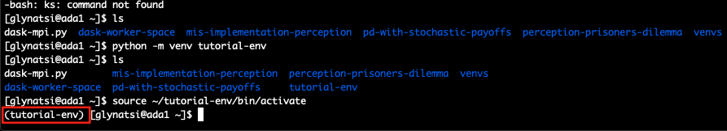

# Virtual Environment with Python on a cluster

Once you are logged in your account on the cluster (with the `ssh` command) you
need to load Python.

In the `ada` cluster at our Institute you can load Python 3.6 with the following
command:

```shell
$ module load python/3.6.6
```

Once you have load Python you can use it to create a virtual environment
running the following command:

```shell
$ python -m venv tutorial-env
```

This command has created a folder in your `home` directory. Type:

```shell
$ ls ~
```

and you should be able to see an `tutorial-env` folder.

Activate the environment to install any necessary packages you need for your
project. To activate the environment just run:


```shell
$ source ~/tutorial-env/bin/activate
```

You should be able to see that the environment in now activated in the terminal.



You can then just install the packages by using the `pip` command.


Requirements file
-----------------

Once you have a virtual environment and you want to install packages it is
easier to do so using a `requirements.txt` file instead of installing all packages
one by one.

For each of you projects have a `requirements.txt` file where you list all
the packages and versions you are using for the specific project.
An example of what should be included in a `requirements.txt` file:

```python
sympy==1.5.1
pandas==1.1.4
numpy==1.16.6
```

In you wanted to install the above packages all at once you just need to run (whilst your environment is activated):

```shell
$ pip install -r requirements.txt
```

Running jobs with virtual environment
-------------

To make sure your jobs on the cluster are using the specific environment you
just need to add an extra line to your `sh` file:

```
source ../venvs/tutorial-env/bin/activate
```

This line has to be before you job. An example of an `sh` file:

```shell
#!/bin/bash
#SBATCH -p amd  # partition (queue)
#SBATCH -J inv-don # job name
#SBATCH -N 1 # number of nodes, use 1-1 if you need exactly one node
#SBATCH -n 2 # number of cores
#SBATCH -t 1-00:00  # time (D-HH:MM)
#SBATCH -o slurm.%j.out # STDOUT
#SBATCH -e slurm.%j.err # STDERR

module load python/3.6.6
source ../venvs/payoffs/bin/activate

python src/invasion.py
```

